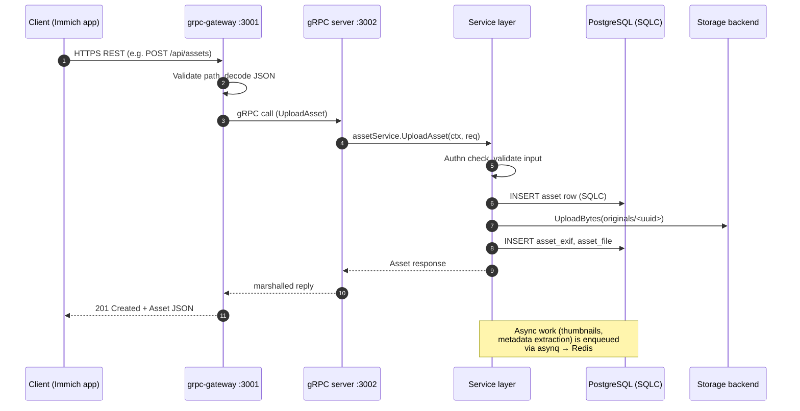
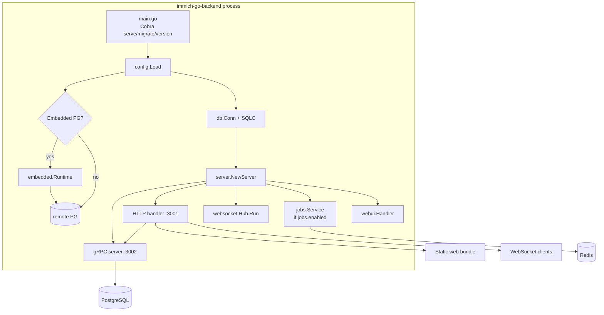
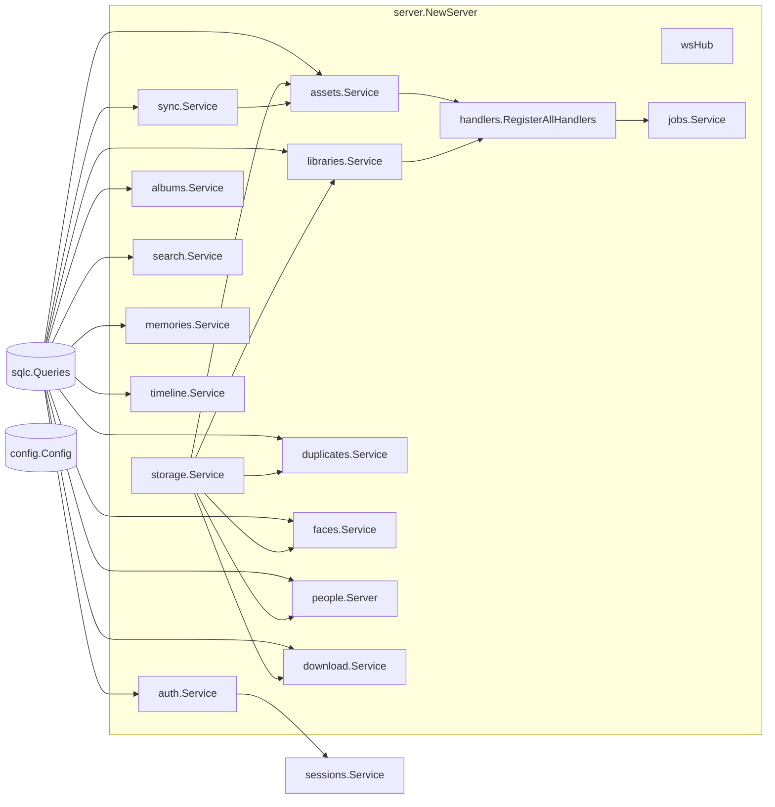
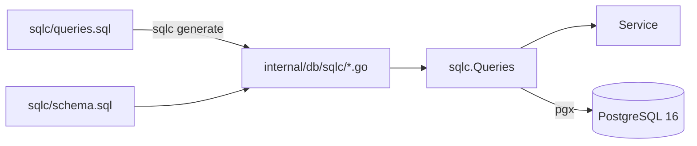
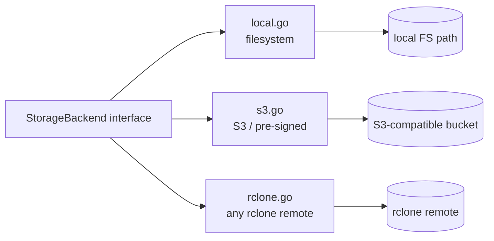
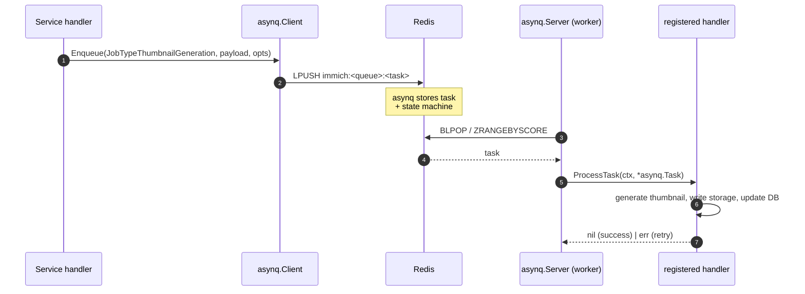
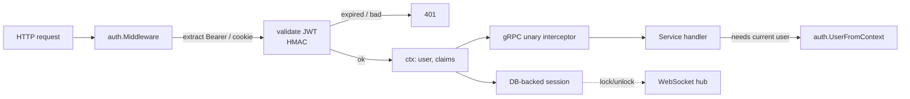
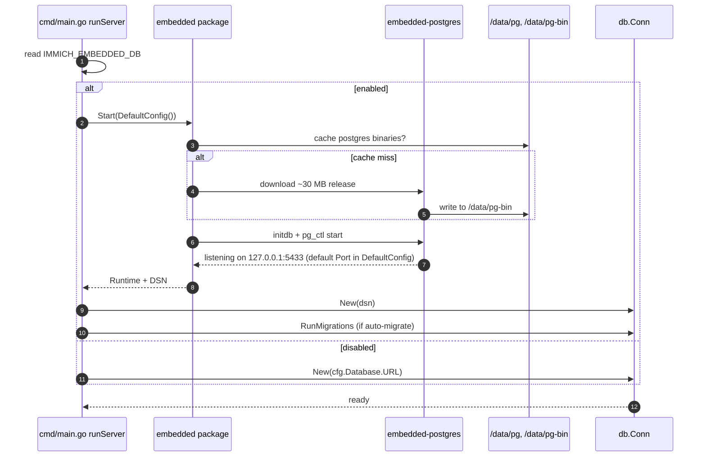

# Architecture

This document walks through how `immich-go-backend` is built, top to bottom. Read it after [README.md](README.md).

## Table of contents

- [Request flow](#request-flow)
- [Process model](#process-model)
- [Service layer](#service-layer)
- [Database access](#database-access)
- [Storage backends](#storage-backends)
- [Job queue](#job-queue)
- [Auth](#auth)
- [WebSocket hub](#websocket-hub)
- [Static web UI](#static-web-ui)
- [Embedded PostgreSQL (demo mode)](#embedded-postgresql-demo-mode)
- [Observability](#observability)

---

## Request flow

A request from any Immich client (web, iOS, Android, CLI) hits `grpc-gateway` on `:3001` (the value from `config.yaml` — the Go default in `internal/config/config.go` is `8080`), is translated to a gRPC frame, and dispatched to the matching service.



Key points:

- The REST surface lives entirely in `grpc-gateway` annotations on the `.proto` files. There is no separate REST router.
- `internal/server.Server.HTTPHandler()` mounts the gateway, the static web UI, and the WebSocket hub on the same `:3001` listener.
- The HTTP gateway is stateless — every request that needs authentication re-reads the JWT from the `Authorization` header (or session cookie) via `internal/auth/middleware.go`.

---

## Process model

A single `immich-go-backend` process owns everything:



- One binary, three Cobra subcommands (`serve`, `migrate`, `version`) — `serve` is the start command.
- `migrate` runs migrations against the configured DB without starting the server.
- `version` prints build-time metadata injected via `-ldflags`.

---

## Service layer

`internal/server/server.go` is the wiring point. Every gRPC service is constructed here, with explicit dependencies, then registered on the gRPC server. Most services follow this shape:

```go
type Service struct {
    db     *sqlc.Queries
    config *config.Config
}

func NewService(db *sqlc.Queries, cfg *config.Config) (*Service, error) {
    return &Service{db: db, config: cfg}, nil
}
```

This is the pattern used by the smaller domains (albums, sharedlinks, tags, ...). Heavier services hold additional collaborators — `assets.Service` carries `*storage.Service`, `*sync.Service`, the metadata extractor and thumbnail generator, and a zap logger; `auth.Service` embeds `config.AuthConfig` directly and adds a session DB and rate limiter; `faces.Service` and `people.Server` add the storage backend. The `internal/<service>/service.go` and `internal/<service>/server.go` split is a project convention, not a hard rule — some packages only have a `Server` (`trash`, `people`, `tags`, `map`) because their gRPC handlers are thin.



A few notes on the wiring:

- `auth.Service` is built first — every other service that touches a `User` ends up depending on it indirectly via the auth middleware (no direct Go field).
- `sync.Service` is built before `assets.Service` so uploads can emit sync events.
- `jobs.Service` is built **after** the asset/library handlers it will dispatch to, because it needs them to register `asynq` handlers.

The `Server` struct in `internal/server/server.go` holds the services inline (`s.authService`, `s.userService`) or as separate `*Server` field pairs (`s.assetService` + the gRPC handlers on `s` itself, or `s.duplicatesService` + `s.duplicatesServer`, etc.) depending on whether the package splits `service.go` from `server.go`. The `Unimplemented*Server` embedded structs are gRPC interface safety nets generated by `protoc-gen-go-grpc`.

---

## Database access

All queries are SQLC-generated from `sqlc/queries.sql` against `sqlc/schema.sql`. There is no ORM, no query builder — every query is hand-written SQL with named parameters.



Conventions:

- Query names map to method names: `-- name: GetAsset :one` becomes `q.GetAsset(ctx, args)`.
- `:one`, `:many`, `:exec` annotations drive return types.
- New SQL goes in `sqlc/queries.sql`, then `make sqlc-gen` regenerates `internal/db/sqlc/`. Never edit generated files by hand.
- New tables / columns go in `sqlc/schema.sql`. There's also `internal/db/migrations/` (a single initial migration at the moment — schema and migrations should agree).

Schema highlights:

- 43 tables covering the full Immich domain model (users, assets, albums, libraries, faces, memories, tags, partners, shared links, sync events, activity, jobs, sessions, system config, audit, etc.).
- Custom enums for asset visibility (`archive`, `timeline`, `hidden`, `locked`) and status (`active`, `trashed`, `deleted`).
- A custom `immich_uuid_v7(timestamp)` function for time-ordered UUIDs.
- Extensions: `uuid-ossp`, `vector` (pgvector), `vchord`, `cube`, `earthdistance`, `pg_trgm`, `unaccent`. The local dev `docker-compose.yml` only enables `uuid-ossp`, `vector`, and `earthdistance` at the image level — the rest are installed by the schema migrations.

Pool sizing lives in `database.max_open_conns` / `max_idle_conns` in `config.yaml`.

---

## Storage backends

The storage layer (`internal/storage/`) is one interface, three implementations:



The interface (`internal/storage/interface.go`) covers uploads, downloads, existence checks, listing, metadata, pre-signed URLs, and copy/move. `SupportsPresignedURLs()` lets the asset service know whether to hand the client a redirect URL or stream bytes itself.

`factory.go` selects the backend based on `STORAGE_BACKEND`:

```go
switch cfg.Backend {
case "s3":     return newS3Backend(cfg.S3)
case "rclone": return newRcloneBackend(cfg.Rclone)
default:       return newLocalBackend(cfg.Local)
}
```

Local paths are configured in `config.yaml` under `storage.local.*` (`upload_location`, `library_location`, `thumbs_location`, `profile_location`, `video_location` in the legacy keys, plus `STORAGE_LOCAL_ROOT` and `UPLOAD_TEMP_DIR` in the structured config).

---

## Job queue

Background work (thumbnail generation, metadata extraction, duplicate detection, library scan, ML indexing) goes through `asynq` over Redis.



Job types are declared in `internal/jobs/service.go`:

- Asset: `thumbnail_generation`, `metadata_extraction`, `video_transcode`, `asset_optimization`
- ML: `face_detection`, `face_recognition`, `smart_search_indexing`, `object_detection`
- Library: `library_scan`, `library_watch`, `duplicate_detection`, `sidecar_processing`
- System: `storage_migration`, `cleanup`, `backup`

Handlers live in `internal/jobs/handlers.go` and are registered via `jobs.NewHandlers(...).RegisterAllHandlers(jobService)` during server boot. If `JOBS_REDIS_URL` is empty (no Redis configured), the job service is skipped with a warning and long-running work isn't enqueued — service code that calls `Enqueue` either logs a warning or returns an error depending on the call site.

---

## Auth

Authentication has two halves:

1. **Middleware** in `internal/auth/middleware.go` extracts the JWT (header or cookie), validates it, and stuffs `User` + `Claims` into the request context. gRPC unary interceptors pick it up via `auth.UserFromContext(ctx)`.
2. **Session** database rows for revocation and lock-out — `internal/sessions/` owns session lifecycle and emits `lock` / `unlock` events over the WebSocket hub.



Rate limiting is implemented in `internal/auth/rate_limiter.go` and applies to login attempts. PIN code setup/change/reset for session locking is part of the auth service.

---

## WebSocket hub

`internal/websocket/websocket.go` runs a single goroutine that multiplexes events to subscribed clients. Services that emit sync events (`assets`, `libraries`, `sessions`, etc.) push onto the hub; the hub fans out JSON-encoded frames to interested clients.

Clients connect to `/api/socket.io/` (kept compatible with Immich's socket.io URLs even though the implementation is a plain WebSocket under the hood).

---

## Static web UI

`internal/webui/handler.go` is a thin static-file wrapper around the REST handler:

- Serves a directory (typically the official Immich web build) on `GET` / `HEAD`.
- Path-traversal guarded (`..` and dotfile-prefixed paths are 404ed).
- `index.html` SPA fallback: any extension-less GET that doesn't match a file on disk gets `index.html`, so client-side routing works.
- When the directory is missing or empty, the handler is a transparent passthrough — useful for local API-only development.

The bundled Dockerfile copies `/build/www` from the official Immich server image into `/app/web`. Set `IMMICH_WEBUI_DIR=/app/web` (or leave it default in the demo image) and the UI is served at `/`.

---

## Embedded PostgreSQL (demo mode)

For the single-binary demo deployment, the binary can launch its own PostgreSQL via `github.com/fergusstrange/embedded-postgres`. The flow:



On SIGTERM/SIGINT the embedded PG is stopped before the DB connection closes, so the cluster shuts down cleanly.

The embedded mode is **single-process** by construction — do not run it behind a load balancer that fans out to multiple machines. For real workloads point `DATABASE_URL` at a managed Postgres and leave `IMMICH_EMBEDDED_DB` unset.

---

## Observability

`internal/telemetry/telemetry.go` wires OpenTelemetry:

- **Tracing.** `go.opentelemetry.io/otel/sdk/trace` with the `autoexport` contrib package, so traces go to whatever OTLP endpoint `OTEL_EXPORTER_OTLP_ENDPOINT` (or one of the env-var variants) points at — Jaeger, Tempo, Honeycomb, vendor-specific, no code change.
- **Metrics.** Same idea via `sdkmetric`. The `/metrics` endpoint serves Prometheus format by default.
- **Service name / version / environment** are configurable via standard OTel env vars (`OTEL_SERVICE_NAME`, etc.).

gRPC and HTTP handlers are instrumented; service methods create child spans via the `tracer.Start(ctx, "service.method")` pattern.

Structured logging is via `logrus` (`json` or `text` format depending on `logging.format`). Log level is `logrus.ParseLevel(cfg.Logging.Level)`. Some hot paths inside `internal/assets` use `go.uber.org/zap` directly — that's a deliberate split, not a migration in progress.

---

## Putting it together

For a happy-path upload:

1. Mobile app `POST /api/assets` (multipart).
2. grpc-gateway dispatches `AssetService.UploadAsset`.
3. Auth middleware verifies the JWT and sets `User` on context.
4. `assets.Service` validates the request, picks a UUID, inserts an `assets` row, writes bytes to the storage backend, then enqueues `thumbnail_generation` + `metadata_extraction` onto asynq.
5. Returns the new `Asset` to the client.
6. A worker (same process, another goroutine) picks up the queued task, generates the thumbnail, writes it back to storage, updates `assets` with thumb path, and emits a sync event over the WebSocket hub.
7. Any subscribed client (the web UI on another device, for example) receives the sync event and refreshes its timeline.

That single happy path touches every subsystem this document describes — read it again as a checklist the next time something needs to change.