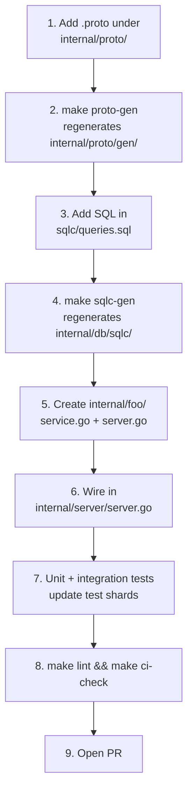

# Contributing

Thanks for taking a look. This document covers the day-to-day workflow for landing changes.

## Ground rules

- **No mocks, stubs, or placeholder data in service code.** Every service method calls real SQLC queries. If a query doesn't exist, add it to `sqlc/queries.sql` and run `make sqlc-gen`. There is no "TODO: implement later" path.
- **Generated code is generated.** Never hand-edit files under `internal/proto/gen/` or `internal/db/sqlc/`.
- **Conventional commits.** `feat(assets): add bulk delete`, `fix(auth): cap login attempts`, `docs(readme): add quickstart`. The CI check enforces the format on PR titles.
- **Tests required for new behaviour.** Unit for the happy path, integration (`-tags=integration`) for anything that touches the database or storage.
- **One change per PR.** Easier to review, easier to revert.

## Local setup

```bash
nix develop           # pinned toolchain
make setup            # generate protos + tidy
make build            # build ./bin/immich-go-backend
docker compose up -d  # postgres + redis for integration tests
./bin/immich-go-backend migrate
make test             # full test suite
make lint             # golangci-lint
```

If you don't have Nix, the project's `go.mod` is plain Go 1.24 — install Go, install `buf`, install `sqlc`, install `golangci-lint`, and run the same Make targets. The `nix develop` shell just pins versions.

## Project layout reminder

- `cmd/` — Cobra entry points (`serve`, `migrate`, `version`).
- `internal/<service>/service.go` — domain services. One package per gRPC service.
- `internal/server/server.go` — wiring. New services get added here.
- `internal/proto/*.proto` — gRPC definitions.
- `internal/proto/gen/` — generated Go (committed).
- `sqlc/queries.sql` + `sqlc/schema.sql` — SQL sources.
- `internal/db/sqlc/` — generated Go (committed).
- `internal/db/migrations/` — embedded SQL migrations.

## Adding a new service

Walking through it end to end:



### 1. Proto

`internal/proto/foo.proto`:

```protobuf
syntax = "proto3";
package immich.v1;

option go_package = "github.com/denysvitali/immich-go-backend/gen/immich/v1;immichv1";

service FooService {
  rpc GetFoo(GetFooRequest) returns (Foo);
  rpc ListFoos(ListFoosRequest) returns (ListFoosResponse);
}

message Foo { string id = 1; string name = 2; }
message GetFooRequest { string id = 1; }
message ListFoosRequest {}
message ListFoosResponse { repeated Foo foos = 1; }
```

The `go_package` path matches every existing proto under `internal/proto/`. `buf.gen.yaml` sets `out: internal/proto`, so generated files land in `internal/proto/gen/immich/v1/`.

Add a REST mapping in `buf.yaml` if you want HTTP routes (`grpc-gateway` annotations).

### 2. Generate

```bash
make proto-gen
```

`buf generate` reads the protos and writes Go to `internal/proto/gen/`. Commit those files.

### 3. SQL

```sql
-- sqlc/queries.sql
-- name: GetFoo :one
SELECT * FROM foos WHERE id = $1;

-- name: ListFoos :many
SELECT * FROM foos ORDER BY name;
```

If you need a new table, add it to `sqlc/schema.sql` first.

### 4. Generate

```bash
make sqlc-gen
```

`sqlc generate` writes the typed Go bindings to `internal/db/sqlc/`. Commit those.

### 5. Service code

```go
// internal/foo/service.go
package foo

import (
    "context"
    "github.com/denysvitali/immich-go-backend/internal/db/sqlc"
)

type Service struct {
    db *sqlc.Queries
}

func NewService(db *sqlc.Queries) *Service {
    return &Service{db: db}
}

func (s *Service) GetFoo(ctx context.Context, id string) (*sqlc.Foo, error) {
    return s.db.GetFoo(ctx, id)
}

func (s *Service) ListFoos(ctx context.Context) ([]sqlc.Foo, error) {
    return s.db.ListFoos(ctx)
}
```

If the service is more than a thin wrapper, add a `Server` type implementing the gRPC interface:

```go
// internal/foo/server.go
type Server struct {
    immichv1.UnimplementedFooServiceServer
    svc *Service
}

func NewServer(svc *Service) *Server { return &Server{svc: svc} }

func (s *Server) GetFoo(ctx context.Context, req *immichv1.GetFooRequest) (*immichv1.Foo, error) {
    f, err := s.svc.GetFoo(ctx, req.GetId())
    if err != nil { return nil, err }
    return &immichv1.Foo{Id: f.ID, Name: f.Name}, nil
}
```

### 6. Wire

In `internal/server/server.go`, add to the `Server` struct and constructor:

```go
fooService := foo.NewService(db.Queries)
fooServer := foo.NewServer(fooService)

// In the Server struct:
fooService *foo.Service
fooServer  *foo.Server

// At the end of NewServer:
immichv1.RegisterFooServiceServer(s.grpcServer, s.fooServer)
```

### 7. Tests

- Unit tests in the same package (`internal/foo/service_test.go`).
- Integration tests in `internal/foo/integration_test.go` with `//go:build integration`, using `internal/db/testdb.SetupTestDB(t)` which spins up a real PostgreSQL container and applies `sqlc/schema.sql`.
- Add the new package to one of the four CI test shards under `.github/test-shards/` (informational today — the workflow doesn't consume them yet).

### 8. CI

```bash
make lint
make ci-check    # proto-gen + lint + test
```

Push and open a PR. CI runs the four shards in parallel.

## Code style

- `gofmt` + `goimports` (run `go fmt ./...`).
- `golangci-lint` with the project's `.golangci.yml` (errcheck, staticcheck, gosec, govet, gofumpt, gocritic, misspell, ...).
- Context-aware error wrapping: `fmt.Errorf("run migrations: %w", err)`.
- Logrus for logging via `logrus.WithError(err).Warn(...)`.
- No `panic` outside `main()` initialisation.
- Prefer table-driven tests.

## Commit messages

Conventional Commits, lowercased scope:

```
feat(assets): add bulk delete endpoint
fix(auth): reject empty password on login
docs(readme): document fly demo
refactor(storage): split factory by backend
test(albums): add integration test for shared access
chore(deps): bump pgx to v5.7.0
```

PR titles follow the same format; the CI check enforces it.

## Reporting issues

Please include:

- What you expected to happen.
- What actually happened (logs, screenshots, a `curl` you ran).
- Server version (`./bin/immich-go-backend version`).
- Config (omit secrets): `config.yaml` redacted, the env vars you set.
- Storage backend (`local` / `s3` / `rclone`) and rough library size.
- Frontend version if it's a UI bug.

For security issues, **don't** open a public issue — see the repo's security policy (when present).