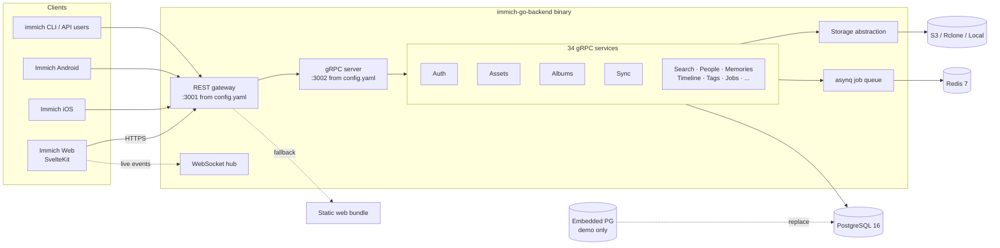

# immich-go-backend

A Go reimplementation of the [Immich](https://github.com/immich-app/immich) backend API, designed for cloud-native deployments with first-class S3, embedded PostgreSQL for single-binary demos, and a clean gRPC + REST architecture.

> [!IMPORTANT]
> **Status: functional, actively developed, not a security audit.** This project targets API parity with the official Immich backend so the official web UI and mobile apps work against it. It is suitable for self-hosting and demo deployments, but it has not undergone an independent security review — review the configuration, secrets handling, and exposure model before relying on it for sensitive data.

---

## Why

The official Immich backend is a battle-tested NestJS stack. This project explores an alternative with:

- **Single binary.** The Go binary can boot an embedded PostgreSQL and serve the official Immich web bundle, so a demo deployment is one container.
- **S3-first storage.** Pre-signed uploads/downloads for native object storage, plus local and Rclone backends.
- **gRPC-first.** Strictly-typed gRPC services with grpc-gateway providing the REST surface that the Immich clients expect.
- **Type-safe SQL.** SQLC generates Go from `sqlc/queries.sql` — no ORM, no string-interpolated SQL.
- **Operational niceties.** OpenTelemetry tracing/metrics, asynq job queue, graceful shutdown, structured logging.

## Architecture at a glance



A REST request hits `grpc-gateway` on `:3001` (the value in `config.yaml` — the Go default is `8080`), is translated to a gRPC call against the matching service, the service runs the business logic against PostgreSQL via SQLC queries, and reads/writes bytes through the storage backend. Long-running work (thumbnail generation, metadata extraction, ML indexing) is enqueued onto Redis via asynq.

For the full architecture — service dependency graph, storage backends, auth context, embedded PG boot sequence, and job flow — see [ARCHITECTURE.md](ARCHITECTURE.md).

## Quickstart

### One command with Docker Compose

```bash
docker compose up -d
./bin/immich-go-backend migrate
./bin/immich-go-backend serve
```

The default `docker-compose.yml` starts PostgreSQL 16 (with `uuid-ossp`, `vector`, and `earthdistance` enabled at the image level — `vchord`, `cube`, `pg_trgm`, and `unaccent` are created by the schema migrations) and Redis 7. The server listens on `:3001` (REST) and `:3002` (gRPC) per `config.yaml` — the Go default in `internal/config/config.go` is `8080`/`9090` and `config.yaml` overrides it.

Open `http://localhost:3001/api/server/ping` to confirm the server is up, then `POST /api/auth/admin-sign-up` to create the first admin.

### One binary, one Fly machine

The fastest way to a public preview. See [DEPLOYMENT.md → Fly.io single-machine demo](DEPLOYMENT.md#flyio-single-machine-demo).

```bash
fly apps create immich-go-demo
fly volumes create immich_data --size 10 --region iad
fly secrets set AUTH_JWT_SECRET="$(openssl rand -hex 32)"
fly deploy
# → https://immich-go-demo.fly.dev
```

The image bundles the official Immich web build and starts an embedded PostgreSQL inside the binary, so the only persistent state is a single Fly volume.

### Live demo

A demo instance runs at **<https://immich-go-backend.fly.dev>**. It is redeployed from `master` on every green CI run and wiped on each deploy (`IMMICH_DEMO_FRESH_ON_DEPLOY`), then verified by the Playwright E2E suite. The suite registers the root admin on the fresh instance:

- Email: `e2e-root-admin@example.com`
- Password: `E2ePassword123!`

Anything you upload there is public and disappears on the next deploy.

### Local development

```bash
nix develop           # pinned toolchain (Go, buf, sqlc, golangci-lint)
make setup            # generate protos + tidy modules
make build            # build ./bin/immich-go-backend
make test             # unit + integration tests (needs Docker)
make lint             # golangci-lint
```

All targets are described in the [Makefile](Makefile). Generated proto code under `internal/proto/gen/` is committed, so a fresh checkout builds without running `buf generate`.

## Project layout

```
cmd/                          CLI entry (Cobra): serve / migrate / version
internal/
  server/                     Wires all services, gRPC server, REST gateway
  <service>/                  One package per gRPC service (assets, albums, ...)
  proto/                      .proto sources + generated Go (gen/ is committed)
  db/                         Database connection, embed.FS migrations
  db/sqlc/                    SQLC-generated Go (do not edit)
  db/testdb/                  testcontainers helpers for integration tests
  storage/                    local / s3 / rclone backends behind one interface
  jobs/                       asynq service + handlers
  embedded/                   embedded PostgreSQL for demo mode
  webui/                      Static-file fallback for the bundled web UI
  websocket/                  Live event hub
  telemetry/                  OpenTelemetry traces + metrics
  auth/                       JWT, sessions, rate limiter, middleware
  config/                     YAML + env-var configuration
sqlc/
  schema.sql                  Database schema (43 tables)
  queries.sql                 240 SQLC query definitions
deploy/                       Dockerfile + fly.toml + scripts
e2e/                          Frontend Playwright tests (upload, view, ...)
```

## Services

The server registers **34 gRPC services** (~222 RPCs) against `internal/proto/`:

| Group | Services (gRPC `Service` names) |
|-------|----------------------------------|
| Identity & access | `AuthService`, `OAuthService`, `UsersService`, `ApiKeyService`, `SessionsService`, `SharedLinksService`, `PartnersService` |
| Library & assets | `AssetService`, `AlbumService`, `LibrariesService`, `DownloadService`, `StacksService`, `TagsService`, `TrashService` |
| Discovery | `SearchService`, `TimelineService`, `MemoryService`, `MapService`, `PeopleService`, `FacesService`, `DuplicatesService`, `ViewService`, `ActivityService` |
| System | `ServerService`, `JobService`, `QueueService`, `MaintenanceService`, `SystemConfigService`, `SystemMetadataService`, `SyncService`, `NotificationsService`, `PluginService`, `WorkflowService`, `AdminService` |

Each service has the same shape: `*sqlc.Queries` + `*config.Config` + the dependencies it actually needs (storage, sync, queue). See [ARCHITECTURE.md → Service layer](ARCHITECTURE.md#service-layer) for the dependency graph.

## Configuration

`config.yaml` is the template. Most fields are overridden by unprefixed environment variables — the pattern is `<SECTION>_<KEY>` in upper snake case, mirroring the YAML path (e.g. `server.address` → `SERVER_ADDRESS`, `database.url` → `DATABASE_URL`, `auth.jwt_secret` → `AUTH_JWT_SECRET`). The exceptions use an `IMMICH_` prefix: `IMMICH_WEBUI_DIR`, `IMMICH_DATABASE_AUTO_MIGRATE`, and `IMMICH_EMBEDDED_DB`. The authoritative list lives in the struct tags of `internal/config/config.go`.

Most useful sections:

| Section | Purpose |
|---------|---------|
| `server` | HTTP/gRPC bind addresses, timeouts, CORS, metrics path |
| `database` | DSN, pool sizing, auto-migrate flag |
| `storage` | Backend (`local` / `s3` / `rclone`); pre-signed URLs (S3 only), upload limits |
| `auth` | JWT secret/expiry, registration toggle, password policy, login rate-limit |
| `jobs` | asynq Redis URL, worker count |
| `telemetry` | OpenTelemetry tracing/metrics toggles, sampling rate |
| `features` | Boolean flags (`FEATURE_MACHINE_LEARNING_ENABLED`, `FEATURE_FACE_RECOGNITION_ENABLED`, `FEATURE_CLIP_SEARCH_ENABLED`, `FEATURE_VIDEO_TRANSCODING_ENABLED`, `FEATURE_THUMBNAIL_GENERATION_ENABLED`, `FEATURE_EXIF_EXTRACTION_ENABLED`, `FEATURE_DUPLICATE_DETECTION_ENABLED`, `FEATURE_BACKUP_SYNC_ENABLED`, `FEATURE_SHARING_ENABLED`, …) |

For the full env-var reference and the precedence rules, see [DEPLOYMENT.md → Configuration](DEPLOYMENT.md#configuration).

## Development

- `make proto-gen` — regenerate `internal/proto/gen/` from `internal/proto/*.proto`
- `make sqlc-gen` — regenerate `internal/db/sqlc/` from `sqlc/queries.sql`
- `make build` / `make test` / `make lint` / `make ci-check`
- Run a single test: `go test -v -run TestName ./internal/auth/...`

The linter is `golangci-lint` with errcheck, ineffassign, staticcheck, unused, gosec, govet, gofmt, gofumpt, goimports, misspell, dogsled, nakedret, gocritic, gosimple, unconvert, and copyloopvar. Generated files are excluded.

CI (`.github/workflows/go.yaml`) runs on Go 1.24 + buf 1.49.0 with two parallel jobs: `build` (unit tests under `-short`, lint, vet) and `integration-tests` (`go test -tags=integration -race` over `./internal/...`). Per-package shard files live under `.github/test-shards/` and are not yet consumed by the workflow.

## Testing

Two layers:

1. **Unit tests** run anywhere with `go test ./...`.
2. **Integration tests** spin up a real PostgreSQL via testcontainers. They require the `integration` build tag:

   ```bash
   go test -tags=integration ./internal/db/...
   go test -tags=integration ./internal/auth/...
   ```

   The shared helper is `internal/db/testdb.SetupTestDB()`. See [TESTING.md](TESTING.md).

## Deployment

Two Dockerfiles cover the deployment matrix:

- `Dockerfile` — base image (external Postgres/Redis, no web bundle). Used for Docker Compose, Kubernetes, plain Docker, and the `ghcr.io/<repo>` release images.
- `Dockerfile.fly` — Fly.io demo image (embedded Postgres, web bundle baked in at `/app/web`, tini for SIGTERM forwarding). Selected via `fly.toml`.

The base image produces a static binary; the Fly image adds the embedded PostgreSQL runtime and the official Immich web build on top. Deployment guides:

- [Fly.io single-machine demo](DEPLOYMENT.md#flyio-single-machine-demo) — fastest path to a public preview
- [Systemd](DEPLOYMENT.md#systemd) — bare-metal / VM
- [Docker Compose](DEPLOYMENT.md#docker-compose) — local or homelab
- [Reverse proxy (Nginx)](DEPLOYMENT.md#reverse-proxy) — TLS, WebSocket upgrade

## Roadmap

The project tracks upstream Immich (`v3.0.2` stable) for parity. See [ROADMAP.md](ROADMAP.md) for the current backlog and what's tracking upstream changes.

## Contributing

Read [CONTRIBUTING.md](CONTRIBUTING.md) for code conventions, the "adding a new service" walkthrough, and how we use conventional commits.

## License

[AGPL-3.0](./LICENSE), matching upstream Immich. This project is an independent reimplementation and is not affiliated with or endorsed by the Immich project.
