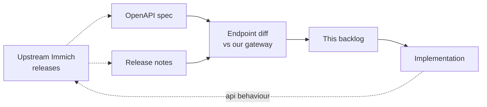

# Roadmap

The active target is **API parity** with upstream Immich so the official web UI and mobile apps work against this backend without modification. We track upstream's `v2.7.x` stable line and watch `v3.0.0-rc.x` for forward-looking changes.

## Tracking upstream

| Stream | Latest | Notes |
|--------|--------|-------|
| Stable | v2.7.5 | The behaviour we aim for in the short term. |
| Preview | v3.0.0-rc.0 | Reviewed for upcoming shape; nothing users rely on yet. |

Sources: [Immich releases](https://github.com/immich-app/immich/releases), the [OpenAPI spec](https://github.com/immich-app/immich/blob/main/open-api/immich-openapi-specs.json), and the [OAuth docs](https://docs.immich.app/administration/oauth).

## Active backlog

### v2.7.x parity

- [x] Rate limiting for login attempts.
- [x] Profile image upload and management.
- [x] User license management.
- [ ] Review shared-link asset removal permissions.
- [x] Implement real version-check RPC.
- [ ] Verify original filename hiding when metadata is disabled.
- [ ] Verify people search behaviour for short queries.
- [x] Streaming support for large gRPC operations.
- [x] Configurable worker pools for background jobs (`JOBS_WORKERS`, default 4).
- [ ] Advanced retry logic for background jobs.

### v3 RC parity

- [ ] Workflows / plugins parity.
- [ ] HLS real-time transcoding.
- [ ] Integrity-report jobs.
- [ ] "Recently added assets" endpoint behaviour.
- [ ] OAuth backchannel logout.
- [ ] Full-path search.
- [ ] Album map markers.
- [ ] User upload heatmap.
- [ ] Assess `pgvecto.rs` removal — vector search is currently on `vector` / `vchord`; check upstream's chosen replacement.
- [ ] Assess duration-in-milliseconds response changes.

## Future enhancements

### Performance & reliability

- [ ] Load testing in CI.
- [ ] Storage performance tests.
- [ ] Database performance tests.
- [ ] Memory usage optimisation.
- [ ] Configurable worker pools.
- [ ] Advanced retry / dead-letter handling for background jobs.

### ML integration (optional, off by default)

- [ ] Face recognition (when the external ML service is reachable).
- [ ] Object detection.
- [ ] CLIP-based smart search.
- [ ] ML-based duplicate detection.

### Video processing

- [x] Video transcoding.
- [x] Video thumbnail generation.
- [x] Video metadata extraction (ffprobe is wired in `internal/assets/metadata.go`).

### Operations

- [ ] Grafana dashboards (against `/metrics` + OTel).
- [ ] Alerting rules (Prometheus / Alertmanager).
- [ ] Helm chart for Kubernetes.

## Non-goals

- Re-skinning or forking the web/mobile clients. We target upstream Immich clients as-is.
- Replacing Immich's existing TypeScript backend. This project is an alternative for environments where a Go binary is preferable.

## Contributing to the roadmap

Open an issue with the `roadmap` label to propose items. For upstream parity items, link the upstream PR / release that introduced the change so reviewers can compare behaviour.