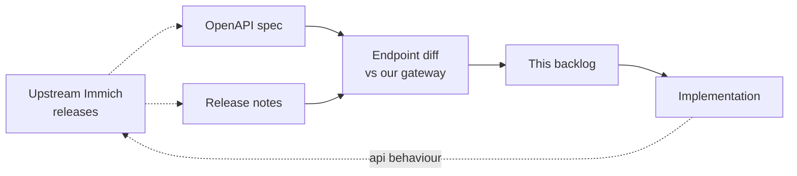

# Roadmap

The active target is **API parity** with upstream Immich so the official web UI and mobile apps work against this backend without modification. We track upstream's `v2.7.x` stable line and watch `v3.0.0-rc.x` for forward-looking changes.

## Tracking upstream

| Stream | Latest | Notes |
|--------|--------|-------|
| Stable | v2.7.5 | The behaviour we aim for in the short term. |
| Preview | v3.0.0-rc.0 | Reviewed for upcoming shape; nothing users rely on yet. |

Sources: [Immich releases](https://github.com/immich-app/immich/releases), the [OpenAPI spec](https://github.com/immich-app/immich/blob/main/open-api/immich-openapi-specs.json), and the [OAuth docs](https://docs.immich.app/administration/oauth).

## Active backlog

### v2.7.x parity

- [x] Rate limiting for login attempts.
- [x] Profile image upload and management.
- [x] User license management.
- [x] Review shared-link asset removal permissions.
  Link ownership, individual-only mutation, and asset ownership on create/add are enforced; metadata redaction covered by tests.
- [x] Implement real version-check RPC.
- [x] Verify original filename hiding when metadata is disabled.
  Shared-link responses redact `originalFileName`, `originalPath`, and EXIF when `showMetadata` is false.
- [x] Verify people search behaviour for short queries.
- [x] Streaming support for large gRPC operations.
- [x] Configurable worker pools for background jobs (`JOBS_WORKERS`, default 4).
- [x] Advanced retry logic for background jobs.

### v3 RC parity

- [ ] Workflows / plugins parity.
  Scaffold exists (in-memory registry + sample plugins); not full upstream plugin host / workflow engine.
- [x] HLS real-time transcoding.
  On-demand HLS via `ensureHLS` + ffmpeg when `Features.VideoTranscodingEnabled`.
- [x] Integrity-report jobs.
  Admin integrity report endpoints scan storage on demand (checksum mismatch, missing, untracked).
- [x] "Recently added assets" endpoint behaviour.
- [ ] OAuth backchannel logout.
  Route + request parsing exist; full logout-token JWT validation / session invalidation still stubbed.
- [x] Full-path search.
  Metadata search (`SearchAssetsFiltered`) and text search (`SearchAssetsByText`) match on `originalPath`.
- [x] Album map markers.
- [x] User upload heatmap.
- [x] Assess `pgvecto.rs` removal — already on `vector` / `vchord` (`vchordrq` indexes for CLIP + face embeddings). Stay on vchord unless upstream picks a different extension.
- [x] Assess duration-in-milliseconds response changes.
  Asset `duration` remains a string (Immich HH:MM:SS / human form in DB). No migration to numeric milliseconds required for current OpenAPI shape.

## Future enhancements

### Performance & reliability

- [ ] Load testing in CI.
- [ ] Storage performance tests.
- [ ] Database performance tests.
- [ ] Memory usage optimisation.
- [ ] Configurable worker pools.
- [x] Advanced retry / dead-letter handling for background jobs.

### ML integration (optional, off by default)

- [ ] Face recognition (when the external ML service is reachable).
- [ ] Object detection.
- [ ] CLIP-based smart search.
- [ ] ML-based duplicate detection.

### Video processing

- [x] Video transcoding.
- [x] Video thumbnail generation.
- [x] Video metadata extraction (ffprobe is wired in `internal/assets/metadata.go`).

### Operations

- [ ] Grafana dashboards (against `/metrics` + OTel).
- [ ] Alerting rules (Prometheus / Alertmanager).
- [ ] Helm chart for Kubernetes.

## Non-goals

- Re-skinning or forking the web/mobile clients. We target upstream Immich clients as-is.
- Replacing Immich's existing TypeScript backend. This project is an alternative for environments where a Go binary is preferable.

## Contributing to the roadmap

Open an issue with the `roadmap` label to propose items. For upstream parity items, link the upstream PR / release that introduced the change so reviewers can compare behaviour.
