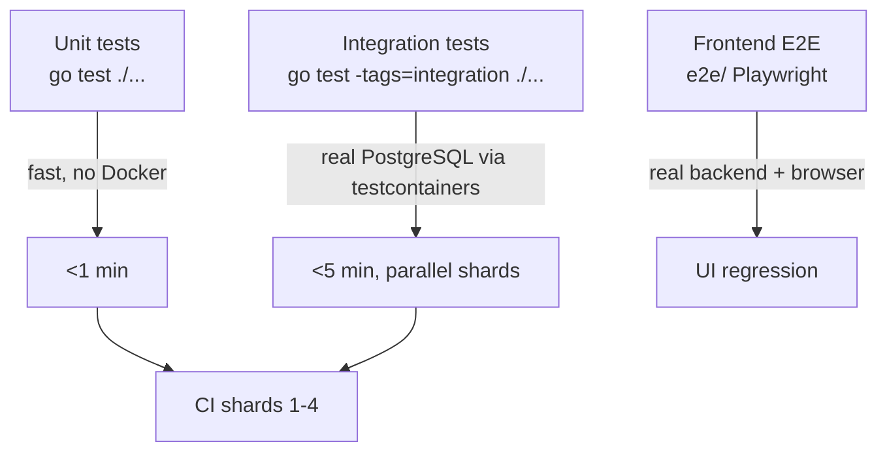
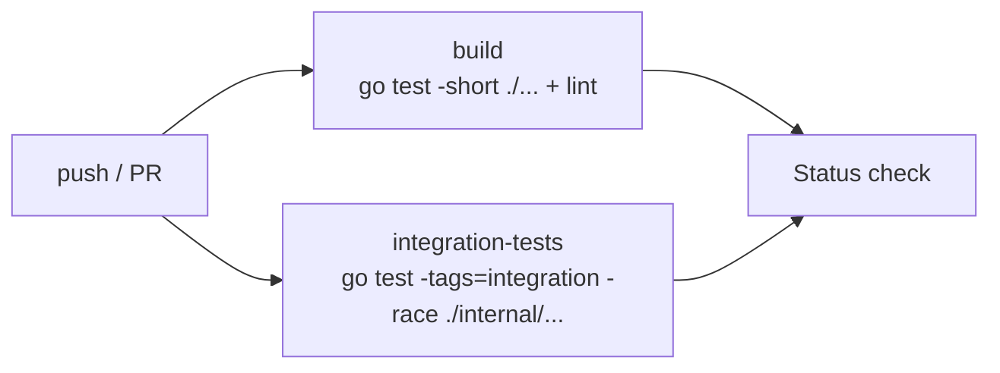

# Testing

This project has three layers of testing, each appropriate to a different concern.



---

## 1. Unit tests

Standard `go test`. No Docker, no PostgreSQL.

```bash
make test                       # all packages
go test ./internal/auth/...     # one package
go test -run TestLogin ./...    # one test by name
go test -v -race ./...          # race detector (slower)
```

When unit-testing a service, mock at the SQLC boundary or use the `internal/db/testdb` helpers (next section) — there are no in-memory mocks for SQLC-generated queries.

---

## 2. Integration tests (`integration` build tag)

Files that spin up real PostgreSQL via [testcontainers-go](https://golang.testcontainers.org/) carry the `//go:build integration` tag. Skipping them by default keeps `go test ./...` portable.

### Run them

```bash
# One package
go test -tags=integration ./internal/auth/...
go test -tags=integration ./internal/db/...

# All integration tests
go test -tags=integration ./...

# Verbose with race
go test -tags=integration -race -v ./internal/...
```

Requires Docker (the testcontainers library needs it). On Linux, your user needs to be able to talk to the Docker socket.

### Shared helper

`internal/db/testdb.SetupTestDB(t)` returns a `*TestDB` (wrapping `*sqlc.Queries`) backed by a real PostgreSQL container with `sqlc/schema.sql` applied. Typical use:

```go
//go:build integration

package myfeature_test

import (
    "testing"

    "github.com/denysvitali/immich-go-backend/internal/db/testdb"
)

func TestSomething(t *testing.T) {
    tdb := testdb.SetupTestDB(t)
    q := tdb.Queries // *sqlc.Queries

    // Use q as a normal SQLC handle.
    // testdb cleans up the container on t.Cleanup.
    // ...
}
```

### Coverage of the integration surface

`internal/db/migrate_test.go` round-trips `sqlc/schema.sql` against a real PG container to catch schema mistakes (bad types, missing extensions) before they ship. `internal/auth/integration_test.go` and `internal/auth/login_onboarded_test.go` exercise login, onboarded state, and rate-limit paths.

---

## 3. Frontend E2E (Playwright)

The `e2e/` directory contains Playwright tests that boot a real backend (against an embedded PG + Fly-shaped config) and drive the bundled web UI in headless Chromium. They run in CI on the `go.yaml` workflow; videos are uploaded as build artifacts.

Locally:

```bash
nix develop
make build
( ./bin/immich-go-backend serve & )
cd e2e
npm ci
npx playwright install --with-deps chromium
npx playwright test
```

The video artifacts in CI help diagnose UI regressions; pull them via the GitHub Actions UI when a test fails.

---

## CI pipeline

`.github/workflows/go.yaml` is the pipeline. It runs on Go 1.24 + buf 1.49.0 with two parallel jobs:

- `build` — `go test -short` over `./...` plus lint/vet.
- `integration-tests` — `go test -tags=integration -race -timeout=10m` over `./internal/...`.



Per-package lists exist under `.github/test-shards/shard-1.txt` … `shard-4.txt` for future sharding but the current workflow does not consume them. `go.yaml` deliberately avoids Nix and Trivy to keep the wall-clock under a few minutes.

---

## Manual testing

### REST smoke

The grpc-gateway endpoint `POST /api/assets` is JSON, not multipart — `UploadAssetRequest` is `{ asset_data: CreateAssetRequest, key?, checksum?, file_content? }`, so the metadata goes inside `asset_data`:

```bash
# Login
curl -X POST http://localhost:3001/api/auth/login \
  -H 'Content-Type: application/json' \
  -d '{"email":"admin@example.com","password":"changeme"}'

export TOKEN="<access_token from response>"

# Upload (metadata only — file bytes go in file_content as base64)
curl -X POST http://localhost:3001/api/assets \
  -H "Authorization: Bearer $TOKEN" \
  -H 'Content-Type: application/json' \
  -d '{
    "assetData": {
      "deviceAssetId": "unique-id-123",
      "deviceId": "test-device",
      "fileCreatedAt": "2026-01-01T00:00:00Z",
      "fileModifiedAt": "2026-01-01T00:00:00Z"
    }
  }'

# List
curl -H "Authorization: Bearer $TOKEN" http://localhost:3001/api/assets
```

### gRPC smoke

Use any gRPC client (e.g. `grpcurl`):

```bash
grpcurl -plaintext -H "Authorization: Bearer $TOKEN" \
  localhost:3002 immich.v1.AssetService/GetAssets
```

The proto descriptors are not served by default (no `reflection.Register` call in `internal/server`); for ad-hoc testing point grpcurl at the proto source tree:

```bash
grpcurl -plaintext -import-path internal/proto \
  -proto asset.proto \
  -H "Authorization: Bearer $TOKEN" \
  localhost:3002 immich.v1.AssetService/GetAssets
```

`common.proto` (and any other transitive imports) are pulled in via the buf work layout, so a single `-proto asset.proto` is enough.

### Mobile app

1. Install the official Immich app on iOS or Android.
2. Settings → Server URL → `http://<your-server>:3001/api`.
3. Log in with the admin credentials you created.
4. Upload a few photos. Verify thumbnails appear (uses the `thumbnail_generation` job — needs Redis if you want async, otherwise degrades).

### Web app

- **Bundled demo image** — visit `https://<app>.fly.dev/`. Login with the admin you created via the REST API.
- **Local API-only** — leave `IMMICH_WEBUI_DIR` unset and point your own Immich web build at the backend (set the web build's `IMMICH_SERVER_URL` to `http://localhost:3001`).

---

## Performance / load

Quick load test with [`hey`](https://github.com/rakyll/hey) or `ab`:

```bash
hey -n 2000 -c 50 -m POST -T application/json \
    -d '{"email":"admin@example.com","password":"changeme"}' \
    http://localhost:3001/api/auth/login

hey -n 5000 -c 100 -H "Authorization: Bearer $TOKEN" \
    http://localhost:3001/api/assets
```

Watch `psql -U immich -c "SELECT count(*) FROM pg_stat_activity;"` and `redis-cli info memory` while the load runs.

---

## Known limitations

- **ML** (face detection, CLIP smart search) requires the optional external `machine_learning` service. Without it, smart search falls back to text-only and faces return empty.
- **HLS / adaptive video streaming** is not yet wired.
- **OAuth mobile redirect** flow is not implemented (regular OAuth login works).
- **Token refresh** endpoint exists; double-check coverage in `internal/auth` before relying on it.

For the full upstream parity backlog, see [ROADMAP.md](ROADMAP.md).